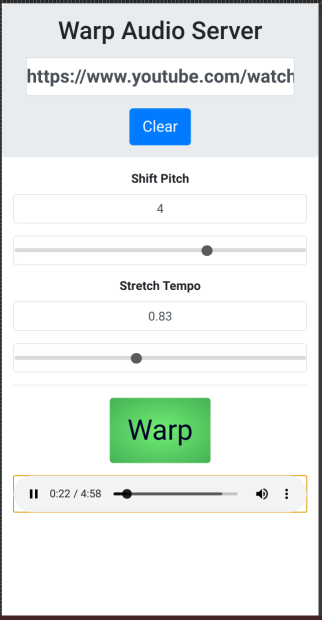

## Warp Audio Server

This is a simple web application that takes a YouTube URL and warps the audio according to user parameters.

It is meant to help musicians experiment with key and tempo changes.



### Dependencies

The following commands must be installed and available within your PATH environment:

- node and npm (both part of [NodeJS](https://nodejs.org/))
- bash
- [youtube-dl](https://yt-dl.org/)
- [ffmpeg](https://ffmpeg.org/)
- [rubberband](https://github.com/breakfastquay/rubberband)
- mkdir and base64 (both part of GNU coreutils)

### Installation

```bash
git clone https://github.com/duhdugg/warp-audio-server.git
cd warp-audio-server
npm install
npm run build
```

### Running

`npm start`

Now visit `http://localhost:8712` in your web browser. You can also use a second device by entering `http://a.b.c.d:8712` into the browser where `a.b.c.d` is the network IP address of the machine running the server.

You can run it on a different port with the following:

`PORT=9000 npm start`

### Security

By default, a new random password will be created and displayed for you when the server starts. You can set a persistent password by running the following:

`npm run set-password`

If you are running on a public interface, you should run it behind a
load balancer such as Nginx with HTTPS enabled. An example configuration file
can be found in the `examples` directory.
